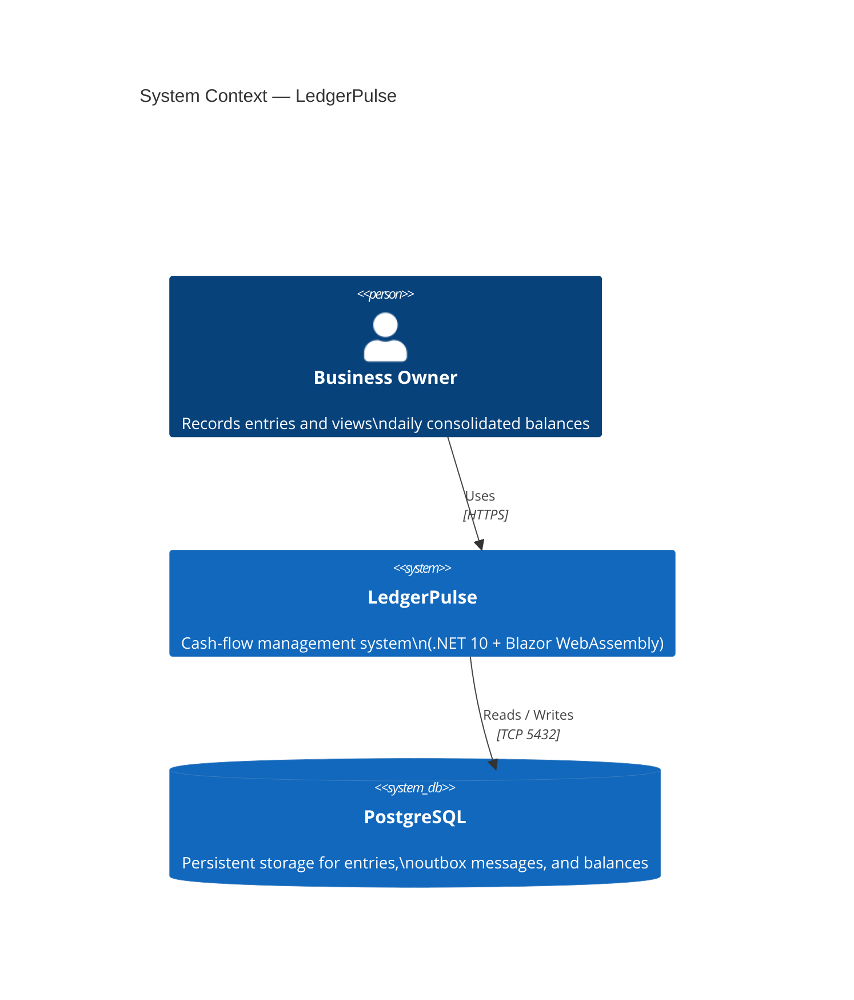
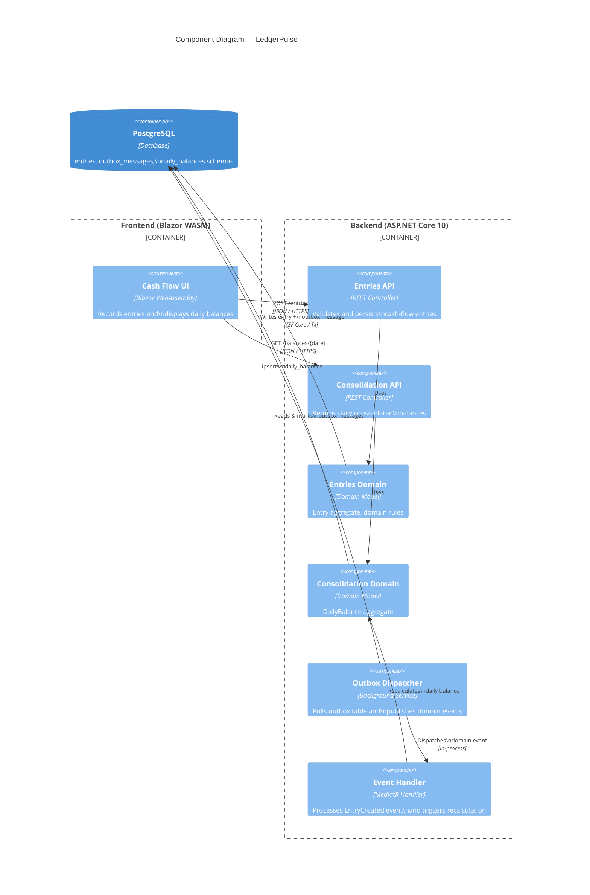
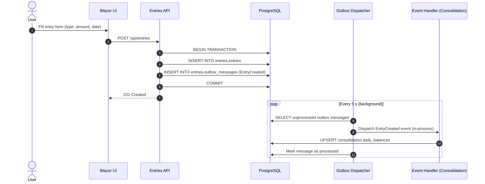
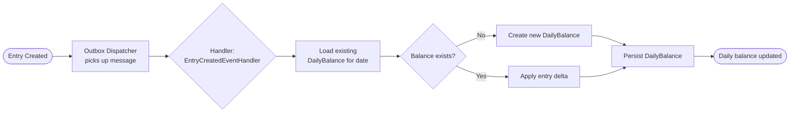

# LedgerPulse

> **A modular cash‑flow management system** that records financial entries (credits and debits) and produces daily consolidated balances — built as a technical challenge solution showcasing .NET 10, PostgreSQL, Docker, Blazor WebAssembly, Domain Events, and the Outbox Pattern.

[](https://dotnet.microsoft.com/)
[](https://www.postgresql.org/)
[](https://docs.docker.com/compose/)
[](https://dotnet.microsoft.com/apps/aspnet/web-apps/blazor)
[](./LICENSE)

---

## Table of Contents

1. [Project Overview](#1-project-overview)
2. [Architecture](#2-architecture)
   - [System Context](#21-system-context)
   - [Component Diagram](#22-component-diagram)
   - [Data Flow — Creating an Entry](#23-data-flow--creating-an-entry)
   - [Data Flow — Daily Consolidation](#24-data-flow--daily-consolidation)
3. [Non‑Functional Requirements](#3-nonfunctional-requirements)
4. [Folder Structure](#4-folder-structure)
5. [Running Locally with Docker Compose](#5-running-locally-with-docker-compose)
6. [Running Automated Tests](#6-running-automated-tests)
7. [API Reference](#7-api-reference)
8. [Future Improvements](#8-future-improvements)

---

## 1. Project Overview

### Business Context

A small‑business owner needs a reliable way to track daily cash flow. Every day, multiple financial transactions (sales, expenses, refunds, etc.) are recorded as **entries** — each carrying a date, type (credit or debit), amount, and a short description. At the end of each business day, a **consolidated balance** is calculated and persisted so that reporting is fast and independent of the raw entry stream.

### Goals

| Goal | How it is addressed |
|---|---|
| Record debits and credits reliably | `Entries` module exposes a REST API; every write is transactional |
| Produce accurate daily balances | `Consolidation` module reacts to domain events and recalculates the day's balance |
| Tolerate transient failures | Outbox Pattern ensures domain events are never lost even if the consumer is temporarily unavailable |
| Remain observable | Structured logging (Serilog), health‑check endpoints, and OpenTelemetry traces |
| Be easy to evolve | Modular monolith allows independent deployment of each module in the future |

---

## 2. Architecture

LedgerPulse follows a **modular monolith** pattern. Two bounded contexts live in the same process but are clearly separated by namespace, data ownership, and communication contracts:

| Module | Responsibility | Owns |
|---|---|---|
| **Entries** | Accept and validate cash‑flow entries | `entries` DB schema |
| **Consolidation** | Maintain the daily consolidated balance | `consolidation` DB schema |

Modules communicate exclusively through **Domain Events** published via the **Outbox Pattern**. No direct method calls cross module boundaries.

```
┌──────────────────────────────────────────────────────────┐
│                    Single Process (API Host)              │
│  ┌─────────────┐   Domain Event   ┌────────────────────┐ │
│  │   Entries   │ ──(Outbox/Inbox)──▶  Consolidation    │ │
│  │   Module    │                  │      Module        │ │
│  └─────────────┘                  └────────────────────┘ │
└──────────────────────────────────────────────────────────┘
```

### 2.1 System Context



### 2.2 Component Diagram



### 2.3 Data Flow — Creating an Entry



### 2.4 Data Flow — Daily Consolidation



---

## 3. Non‑Functional Requirements

### Scalability

| Concern | Strategy |
|---|---|
| Write throughput | Entry writes are lightweight inserts; the Outbox Dispatcher is a single background worker (can be scaled to a dedicated worker process without API changes) |
| Read throughput | Consolidated balances are pre‑computed and stored; reads never touch the raw `entries` table |
| Horizontal scaling | The API is stateless; multiple replicas can run behind a load balancer. The Outbox Dispatcher uses an optimistic‑locking `claimed_at` column to avoid duplicate processing |

### Resilience

| Concern | Strategy |
|---|---|
| Entry write failure | Transactional Outbox guarantees atomicity — an entry and its outbox message are always written together or not at all |
| Consolidation consumer failure | Unprocessed outbox messages remain in the table and are retried on the next polling cycle |
| Database unavailability | Polly retry policies with exponential backoff wrap all database calls |
| Partial balance corruption | DailyBalance recalculation is idempotent — re‑running the event produces the same result |

### Observability

- **Structured logging** via Serilog (JSON sink in production, console sink in development)
- **Health checks** at `/health` (liveness) and `/health/ready` (readiness, checks DB connectivity)
- **OpenTelemetry** traces exported to a configurable OTLP endpoint (e.g., Jaeger)
- **Metrics** exposed at `/metrics` via Prometheus‑compatible endpoint

### Security

- API protected by JWT Bearer authentication
- HTTPS enforced in production Docker Compose profile
- Passwords and secrets injected via environment variables; never hard‑coded

---

## 4. Folder Structure

```
LedgerPulse/
├── src/
│   ├── LedgerPulse.Api/                   # ASP.NET Core host — DI wiring, middleware, controllers
│   │   ├── Controllers/
│   │   │   ├── EntriesController.cs       # POST /api/entries, GET /api/entries
│   │   │   └── ConsolidationController.cs # GET /api/balances/{date}
│   │   ├── Program.cs
│   │   └── appsettings.json
│   │
│   ├── LedgerPulse.Modules.Entries/       # Entries bounded context
│   │   ├── Domain/
│   │   │   ├── Entry.cs                   # Aggregate root
│   │   │   ├── EntryType.cs               # Value object (Credit | Debit)
│   │   │   └── Events/
│   │   │       └── EntryCreatedEvent.cs   # Domain event
│   │   ├── Application/
│   │   │   ├── Commands/
│   │   │   │   └── CreateEntryCommand.cs  # MediatR command + handler
│   │   │   └── Queries/
│   │   │       └── GetEntriesQuery.cs
│   │   └── Infrastructure/
│   │       ├── EntriesDbContext.cs        # EF Core context (entries schema)
│   │       └── OutboxRepository.cs        # Outbox message persistence
│   │
│   ├── LedgerPulse.Modules.Consolidation/ # Consolidation bounded context
│   │   ├── Domain/
│   │   │   └── DailyBalance.cs            # Aggregate root
│   │   ├── Application/
│   │   │   └── EventHandlers/
│   │   │       └── EntryCreatedEventHandler.cs # Handles domain event
│   │   └── Infrastructure/
│   │       └── ConsolidationDbContext.cs  # EF Core context (consolidation schema)
│   │
│   ├── LedgerPulse.Infrastructure/        # Cross‑cutting infrastructure
│   │   ├── Outbox/
│   │   │   └── OutboxDispatcherService.cs # Background service (polling)
│   │   └── Persistence/
│   │       └── Migrations/                # EF Core migrations
│   │
│   └── LedgerPulse.Web/                   # Blazor WebAssembly frontend
│       ├── Pages/
│       │   ├── Entries.razor              # Entry form + list
│       │   └── Dashboard.razor            # Daily balance view
│       ├── Services/
│       │   └── ApiClient.cs               # Typed HTTP client
│       └── Program.cs
│
├── tests/
│   ├── LedgerPulse.UnitTests/             # Domain and application layer unit tests
│   ├── LedgerPulse.IntegrationTests/      # EF Core + PostgreSQL integration tests (Testcontainers)
│   └── LedgerPulse.ArchitectureTests/     # NetArchTest rules (module boundary enforcement)
│
├── docker/
│   ├── Dockerfile.api                     # Multi‑stage build for the API
│   └── Dockerfile.web                     # Multi‑stage build for Blazor WASM
│
├── docker-compose.yml                     # Development stack (API + Web + DB)
├── docker-compose.prod.yml                # Production overrides
├── .env.example                           # Environment variable template
└── README.md
```

> **Module boundary rule:** No project in `LedgerPulse.Modules.Entries` may reference any type in `LedgerPulse.Modules.Consolidation` and vice versa. This is enforced by NetArchTest in the architecture test suite.

---

## 5. Running Locally with Docker Compose

### Prerequisites

- [Docker Desktop](https://www.docker.com/products/docker-desktop/) ≥ 4.x (or Docker Engine + Compose plugin)
- Git

### Steps

```bash
# 1. Clone the repository
git clone https://github.com/ggbarcelos/LedgerPulse.git
cd LedgerPulse

# 2. Copy the environment variable template
cp .env.example .env
# Edit .env and set your preferred secrets (JWT_SECRET, POSTGRES_PASSWORD, etc.)

# 3. Start all services
docker compose up --build
```

Once all containers are running:

| Service | URL |
|---|---|
| Blazor WebAssembly UI | <http://localhost:5000> |
| REST API (Swagger UI) | <http://localhost:5001/swagger> |
| API Health Check | <http://localhost:5001/health> |
| PostgreSQL | `localhost:5432` (user: `ledger`, db: `ledgerpulse`) |

### Stopping the stack

```bash
docker compose down          # stop containers, preserve volumes
docker compose down -v       # stop containers and remove volumes (clears DB)
```

### Environment Variables (`.env.example`)

```dotenv
POSTGRES_USER=ledger
POSTGRES_PASSWORD=changeme
POSTGRES_DB=ledgerpulse
JWT_SECRET=replace_with_a_long_random_secret
ASPNETCORE_ENVIRONMENT=Development
OTLP_ENDPOINT=http://jaeger:4317   # optional — remove to disable tracing
```

---

## 6. Running Automated Tests

### Prerequisites

- [.NET 10 SDK](https://dotnet.microsoft.com/download/dotnet/10.0)
- Docker (required for integration tests — Testcontainers spins up a real PostgreSQL instance)

### Run all tests

```bash
dotnet test LedgerPulse.sln
```

### Run by category

```bash
# Unit tests only (no Docker required)
dotnet test tests/LedgerPulse.UnitTests

# Integration tests (requires Docker)
dotnet test tests/LedgerPulse.IntegrationTests

# Architecture boundary tests
dotnet test tests/LedgerPulse.ArchitectureTests
```

### Test coverage report

```bash
dotnet test LedgerPulse.sln \
  --collect:"XPlat Code Coverage" \
  --results-directory ./coverage

# Generate HTML report (requires reportgenerator tool)
dotnet tool install -g dotnet-reportgenerator-globaltool
reportgenerator -reports:"coverage/**/coverage.cobertura.xml" \
                -targetdir:"coverage/report" \
                -reporttypes:Html
```

Open `coverage/report/index.html` in your browser.

### What is tested

| Layer | Test type | Tool |
|---|---|---|
| Domain model (aggregates, value objects) | Unit | xUnit |
| Application commands & queries | Unit (mocked deps) | xUnit + NSubstitute |
| Outbox Dispatcher | Unit (in‑memory clock) | xUnit |
| Repository + EF Core mappings | Integration | Testcontainers + EF Core |
| Full HTTP request cycle | Integration | `WebApplicationFactory<Program>` |
| Module boundary isolation | Architecture | NetArchTest |

---

## 7. API Reference

All endpoints require a valid JWT Bearer token unless noted otherwise.

### Entries

| Method | Path | Description |
|---|---|---|
| `POST` | `/api/entries` | Record a new cash‑flow entry |
| `GET` | `/api/entries?date={date}` | List entries for a specific date |

**POST /api/entries — request body**

```json
{
  "date": "2024-11-15",
  "type": "Credit",
  "amount": 1500.00,
  "description": "November sales revenue"
}
```

**Response: 201 Created**

```json
{
  "id": "3fa85f64-5717-4562-b3fc-2c963f66afa6",
  "date": "2024-11-15",
  "type": "Credit",
  "amount": 1500.00,
  "description": "November sales revenue",
  "createdAt": "2024-11-15T09:32:00Z"
}
```

### Consolidation

| Method | Path | Description |
|---|---|---|
| `GET` | `/api/balances/{date}` | Get the consolidated balance for a date |
| `GET` | `/api/balances?from={date}&to={date}` | Get consolidated balances for a date range |

**Response: 200 OK**

```json
{
  "date": "2024-11-15",
  "totalCredits": 3200.00,
  "totalDebits": 850.00,
  "netBalance": 2350.00,
  "lastUpdatedAt": "2024-11-15T23:59:05Z"
}
```

### Health

| Method | Path | Auth | Description |
|---|---|---|---|
| `GET` | `/health` | None | Liveness probe |
| `GET` | `/health/ready` | None | Readiness probe (checks DB) |

---

## 8. Future Improvements

| # | Improvement | Rationale |
|---|---|---|
| 1 | **Extract modules into microservices** | When write/read throughput demands diverge, Entries and Consolidation can be deployed as independent services communicating via a message broker (e.g., RabbitMQ or Azure Service Bus) |
| 2 | **Replace polling Outbox with CDC** | Change Data Capture (Debezium + Kafka) eliminates polling latency and reduces DB load at high event volumes |
| 3 | **CQRS read models** | Add a dedicated read‑side projection for the dashboard (e.g., a Redis cache or a separate read DB) to further decouple query performance from write operations |
| 4 | **Multi‑tenant support** | Partition entries and balances by `tenant_id` to serve multiple business owners from a single deployment |
| 5 | **Event sourcing for Entries** | Store every state transition as an immutable event instead of the current snapshot model, enabling full audit trails and temporal queries |
| 6 | **CI/CD pipeline** | Add GitHub Actions workflows for build, test, Docker image publish, and deployment to a cloud provider (Azure Container Apps / AWS ECS) |
| 7 | **Rate limiting & API gateway** | Protect public endpoints with rate limiting middleware and consider an API gateway for auth offloading and routing |
| 8 | **Mobile / PWA** | Convert the Blazor WASM app into a Progressive Web App so it can be installed on mobile devices and work offline |

---

## License

Distributed under the [MIT License](./LICENSE).

---

<p align="center">
  Built with ❤️ using .NET 10 · PostgreSQL · Docker · Blazor WebAssembly
</p>
