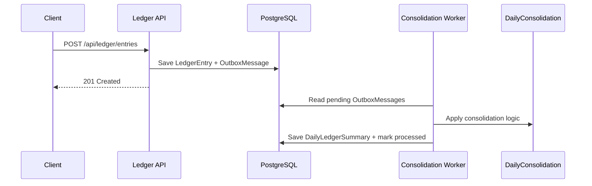

# Consolidation Flow

```mermaid
sequenceDiagram
    participant Client
    participant API as Ledger API
    participant DB as PostgreSQL
    participant Worker as Consolidation Worker
    participant Daily as DailyConsolidation

    Client->>API: POST /api/ledger/entries
    API->>DB: Save LedgerEntry + OutboxMessage
    API-->>Client: 201 Created
    Worker->>DB: Read pending OutboxMessages
    Worker->>Daily: Apply consolidation logic
    Worker->>DB: Save DailyLedgerSummary + mark processed
```
