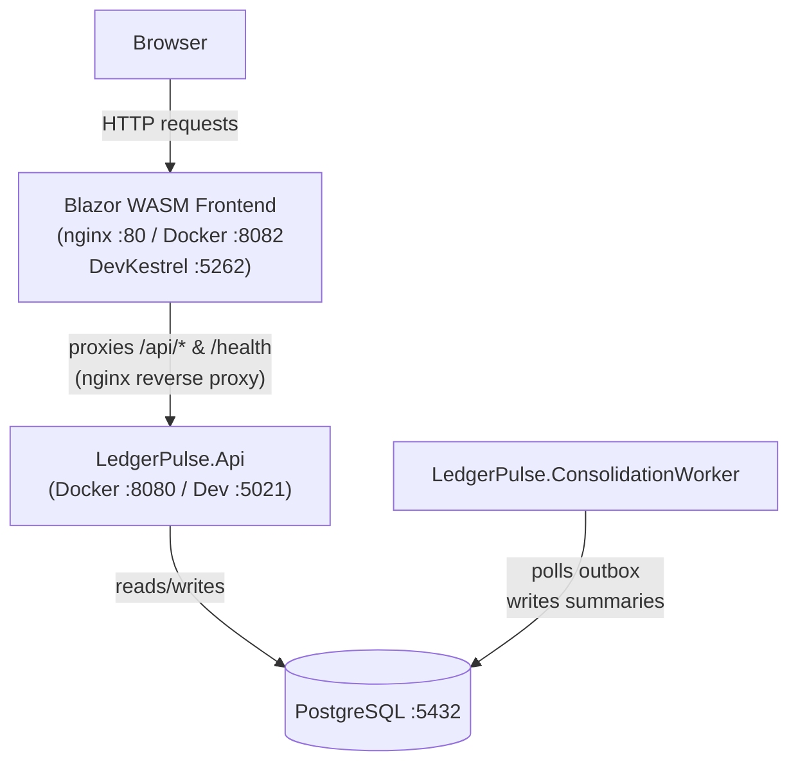

# Container View

> **Nota Docker:** o container `frontend` executa um script `wait-for-api.sh` que aguarda a API responder em `/health` antes de iniciar o nginx, evitando erros `502 Bad Gateway` logo apos `docker compose up`.
> **Nota local (sem Docker):** o frontend usa `http://localhost:5021/` como `ApiBaseUrl` (definido em `wwwroot/appsettings.Development.json`) e a API libera CORS para a origem `http://localhost:5262`.
