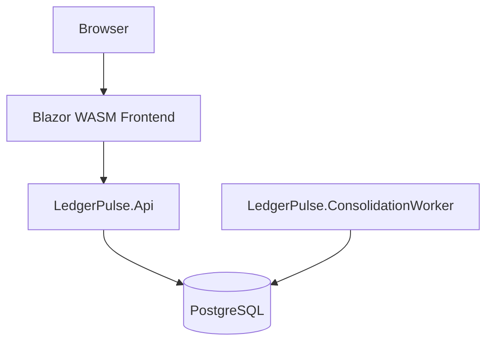

# Container View

```mermaid
flowchart TB
    Browser[Browser]
    Frontend[Blazor WASM Frontend]
    Api[LedgerPulse.Api]
    Worker[LedgerPulse.ConsolidationWorker]
    Postgres[(PostgreSQL)]

    Browser --> Frontend
    Frontend --> Api
    Api --> Postgres
    Worker --> Postgres
```
