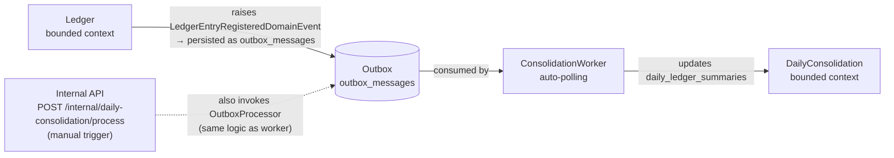

# Context Map

```mermaid
flowchart LR
    Ledger[Ledger\nbounded context]
    Outbox[(Outbox\noutbox_messages)]
    Daily[DailyConsolidation\nbounded context]
    Worker[ConsolidationWorker\nauto-polling]
    InternalAPI["Internal API\nPOST /internal/daily-consolidation/process\n(manual trigger)"]

    Ledger -->|"raises LedgerEntryRegisteredDomainEvent\n→ persisted as outbox_messages"| Outbox
    Outbox -->|"consumed by"| Worker
    Worker -->|"updates daily_ledger_summaries"| Daily
    InternalAPI -.->|"also invokes OutboxProcessor\n(same logic as worker)"| Outbox
```

> O `ConsolidationWorker` e o endpoint interno partilham exatamente o mesmo `OutboxProcessor`; as atualizacoes sao idempotentes e seguras para execucao concorrente.
